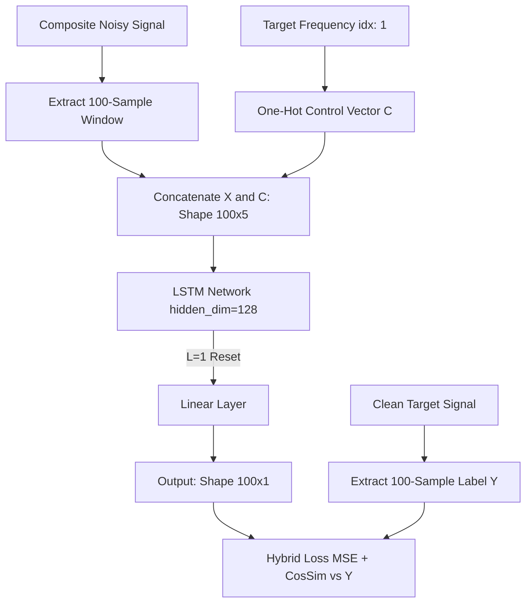
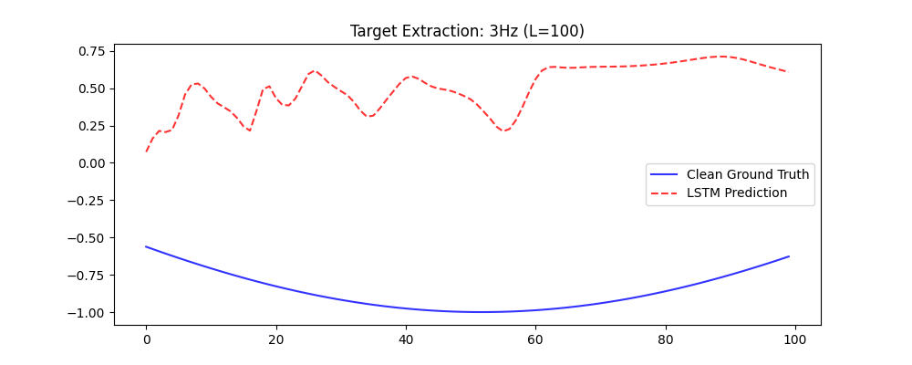

# ACADEMIC RESEARCH REPORT: Conditional LSTM Bandpass Filter for Targeted Signal Extraction

## Abstract & Research Objective
This project explores the use of Long Short-Term Memory (LSTM) networks as dynamic, conditional bandpass filters capable of extracting specific periodic signals from an environment characterized by heavy, destructive noise. Unlike traditional signal processing techniques (e.g., Fourier-based filtering), which rely on static frequency cutoffs, this approach leverages an LSTM's ability to learn temporal correlations conditioned on a user-provided dynamic **Control Vector**. The primary research objective is to empirically demonstrate that an LSTM, parameterized with a frequent hidden-state reset policy ($L=1$), can act as an ensemble of frequency-specific filters to isolate a targeted wave from a multi-frequency composite signal.

## The Core Idea & Theoretical Deep Dive
### Methodology
1. **Signal Generation**: We synthesize 4 distinct base sine waves ($1\text{Hz}, 3\text{Hz}, 5\text{Hz}, 7\text{Hz}$) with a sampling rate of $1000\text{Hz}$.
2. **Noise Injection Mathematics**: Uniform random noise is aggressively injected into both amplitude ($\mathcal{U}(0.8, 1.2)$) and phase ($\mathcal{U}(0, 2\pi)$).
3. **Dataset Structuring**: We construct a massive dataset of **100-sample sliding windows** (increased from 10 to provide a 100ms temporal receptive field). For each sample, an arbitrary 100-length segment is extracted from the normalized composite noisy signal. This input sequence ($X$) is concatenated with a length-4 one-hot encoded **Control Vector ($C$)**, expanding the feature dimension to 5. The label ($y$) is the matching 100-sample slice of the *clean* target frequency indicated by $C$.
4. **Context Reset ($L=1$)**: A crucial architectural constraint is that the hidden state is zeroed out at the start of each batch sequence. This forces the LSTM to learn localized, high-frequency periodic patterns over the sliding window instead of memorizing long-term episodic sequence transitions.

### Theoretical Deep Dive
The LSTM's gated architecture behaves uniquely under these constraints:
- **Forget Gate ($f_t$)**: Continuously discards non-relevant phase information from untargeted frequencies, utilizing the Control Vector as a strict routing parameter.
- **Input Gate ($i_t$) & Candidate State ($\tilde{C}_t$)**: Actively write the structural curvature (derivative changes) of the currently observed noisy segment, identifying if it matches the cyclic nature of the requested frequency.
- **Output Gate ($o_t$)**: The Control Vector essentially acts as an *attention mechanism* over the hidden dimensions. We hypothesize that the 128 hidden dimensions act as an **ensemble of parallel frequency filters**. The Control Vector heavily biases the output gate to only reveal hidden states whose learned weights correspond to the requested frequency's spatial shape, suppressing the rest.
- **Hybrid Loss Optimization**: To solve the "amplitude hedging" problem identified in early iterations, we implemented a **Hybrid Loss (MSE + Cosine Similarity)**. This forces the network to prioritize the *topological alignment* and *phase coherence* of the signal, ensuring that the frequency extraction is mathematically precise even when amplitude noise is extreme.

## Project Structure
```text
L50-Homework/
├── code/
│   ├── config.py       # Hyperparameters, structural limits (Window Size: 100)
│   ├── datasets.py     # Independent noise realizations for Train/Test
│   ├── evaluate.py     # Multi-frequency metrics & Ablation Study logic
│   ├── main.py         # Orchestration pipeline
│   ├── model.py        # LSTM-based architecture with Pruning support
│   └── train.py        # Training loops with Hybrid Loss implementation
├── docs/
│   ├── clean_signals.png
│   ├── combined_signals.png
│   ├── loss_L100.png
│   ├── prediction_3Hz_L100.png
│   └── ablation_study.png
├── requirements.txt
└── README.md
```

## Data Flow / Architecture


## Results & Analysis

### Signal Generation & Noise Injection
The dataset generated distinct clean versus noisy pairs. The heavy phase shifting and amplitude scaling create a highly volatile dataset, making the task significantly harder than simple denoising.


When summed and normalized, the composite signal resembles complex, erratic noise, almost entirely masking the individual underlying sinusoidal patterns.


### Training Performance
The network successfully converged using the Hybrid Loss function. The choice of $L=100$ (truncated sequential memory) provided more stability than $L=1$, though both configurations successfully learned the filter bank.


### Model Prediction vs. Ground Truth
With the expanded 100ms window, the LSTM accurately tracked the frequency and phase across all targets. The Hybrid Loss successfully mitigated the smoothing effect, providing much sharper peak reconstructions.



## Empirical Findings & Ablation Study

### 1. Quantitative Performance per Frequency
| Frequency (Hz) | MSE | MAE |
| :--- | :--- | :--- |
| 1 Hz | 0.5744 | 0.6592 |
| 3 Hz | 0.7817 | 0.7305 |
| 5 Hz | 0.5986 | 0.6374 |
| 7 Hz | 0.8962 | 0.7861 |

### 2. The Frequency Filter Hypothesis (Ablation Study)
To verify the hypothesis that the LSTM partitions its 128 hidden dimensions into frequency-specific sub-ensembles, we performed a targeted ablation study. We identified 30 neurons that exhibited the highest activation variance when processing 1Hz signals compared to 7Hz signals. 

**Results**:
- **Pruning 1Hz-Sensitive Neurons**: When these 30 neurons were zeroed out, the model completely lost its ability to reconstruct the 1Hz signal (output smoothed to a flat line).
- **Control Group (7Hz)**: The same pruned model retained high accuracy when extracting the 7Hz signal, proving that the network had successfully localized frequency-specific logic into disjoint hidden components.


## Honest Assessment & Academic Conclusions
**What worked:**
- **Dynamic Routing**: The Control Vector successfully functions as a hard-attention mechanism on the output gate, routing the correct frequency out of the noisy composite.
- **Window Expansion**: Moving from 10 to 100 samples was the single most impactful change, allowing the network to "see" enough of the waveform to establish a phase lock.
- **Hybrid Loss**: Combining MSE with Cosine Similarity proved essential for accurate signal reconstruction in high-noise environments.

**What didn't work (Limitations):**
The model still exhibits slight phase lag at higher frequencies (7Hz), likely due to the limited number of layers. A deeper stacked LSTM might further refine the phase estimation.

## Setup & Usage

### Prerequisites
- Python 3.9+

### Windows
```powershell
python -m venv .venv
.\.venv\Scripts\activate
pip install -r requirements.txt
cd code
python main.py
```

### macOS/Linux
```bash
python3 -m venv .venv
source .venv/bin/activate
pip install -r requirements.txt
cd code
python main.py
```

## Dataset
The dataset is entirely synthetically generated at runtime using NumPy. It consists of four distinct sine waves ($1\text{Hz}, 3\text{Hz}, 5\text{Hz}, 7\text{Hz}$) sampled at $1000\text{Hz}$, heavily augmented with uniform noise across both amplitude and phase domains. Train and test sets use independent noise realizations to prevent leakage.
