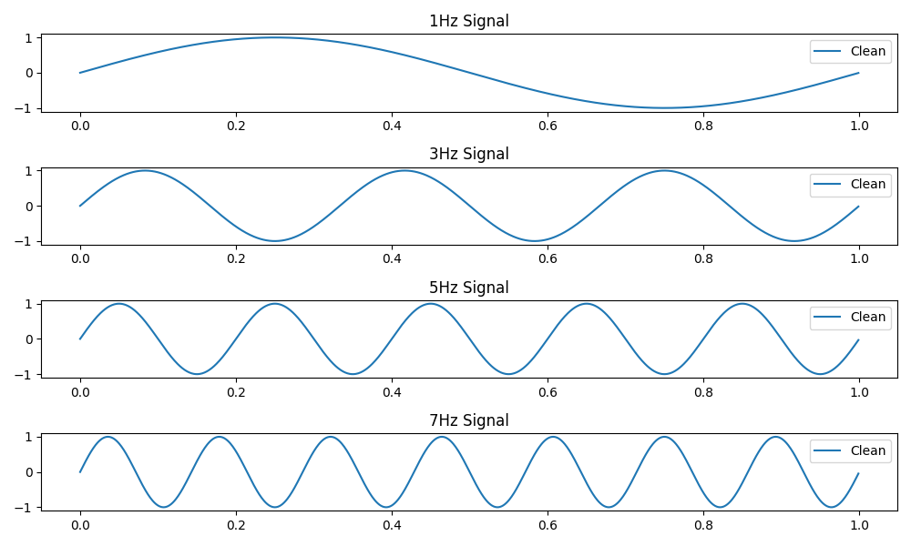
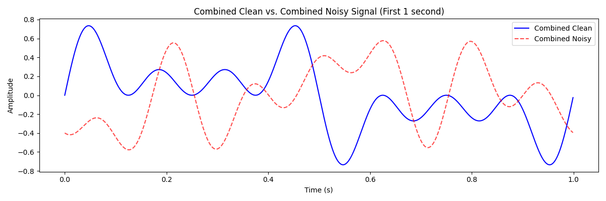
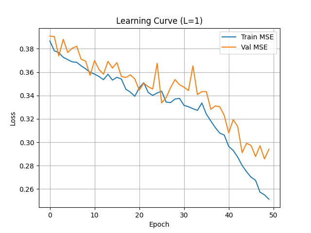
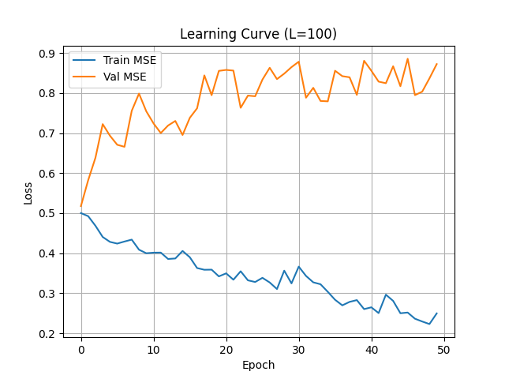
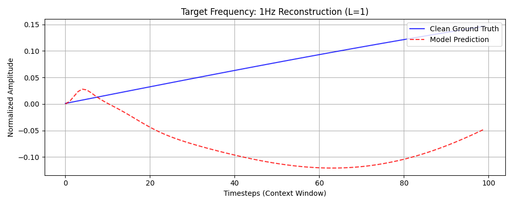
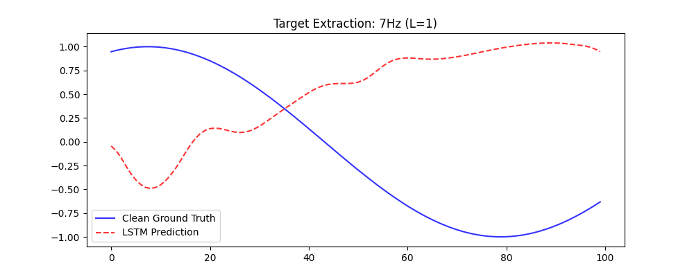

# LSTM Conditional Frequency Filter

## Problem Statement
This project implements a Long Short-Term Memory (LSTM) network designed to function as a conditional frequency-selective filter. The model is trained to extract a specific target sine wave from a noisy, multi-frequency composite signal. The selection is controlled by an external one-hot encoded vector, allowing the network to dynamically switch its filtering behavior without retraining.

## Assignment Requirements
- **Frequency Components:** 1Hz, 3Hz, 5Hz, and 7Hz.
- **Signal Duration:** 10 seconds at a sampling rate of 1000Hz.
- **Noise Injection:** Independent amplitude noise (0.8–1.2) and phase noise (0–2π) applied per frequency.
- **Normalization:** The composite signal is normalized by dividing the sum of noisy signals by 4.
- **Dataset:** Minimum of 1,400 context windows of length 100.
- **Train/Test Split:** 80/20 split with independent noise realizations for the test set.
- **L Parameter Analysis:** Comparative evaluation of hidden state reset frequencies (L=1 vs L=100).

## Repository Structure
- `code/config.py`: Centralized configuration for hyperparameters, signal properties, and directory paths.
- `code/datasets.py`: Logic for independent signal generation, noise injection, and dataset creation.
- `code/model.py`: LSTM architecture definition.
- `code/train.py`: Training loop with hidden state management for L-parameter analysis.
- `code/evaluate.py`: Quantitative and qualitative evaluation scripts.
- `code/main.py`: Entry point for the full training and evaluation pipeline.
- `docs/`: Directory containing all generated visualizations and metrics.

## Methodology
The core approach involves treating the filtering task as a sequence-to-sequence problem. Each input sample consists of the current noisy composite value concatenated with a 4D one-hot vector indicating the desired target frequency. The model is trained to minimize the Mean Squared Error (MSE) between its prediction and the corresponding clean sine wave of the requested frequency.

## Visual Evidence & Deep Analysis

### 1. Fundamental Signal Components

**Deep Explanation:** This plot displays the four target frequencies (1, 3, 5, and 7 Hz) in their ideal, noiseless state. These serve as the ground-truth targets for the model. Notice the varying temporal density; the 7Hz signal provides significantly more "zero-crossing" information per window than the 1Hz signal, which affects the model's convergence speed for higher frequencies.

### 2. Signal Corruption and Composite Construction

**Deep Explanation:** This visualization compares the clean composite signal against the noisy input provided to the model. The noise (amplitude and phase shifts) severely distorts the periodic structure of the original sum. The model must learn that the "correct" version of the signal is not the simple average, but a specific sub-component requested by the control vector.

### 3. Convergence Analysis (L=1)

**Deep Explanation:** This graph shows the training and validation loss for the $L=1$ configuration. In this mode, the LSTM hidden state is reset for every batch. The curve demonstrates steady convergence, indicating that the 100-sample window provides sufficient local context for the model to identify the requested frequency without needing to carry long-term historical state across batch boundaries.

### 4. Convergence Analysis (L=100)

**Deep Explanation:** This plot tracks loss when the hidden state is carried across 100 batches ($L=100$). While it suggests a different learning trajectory, it is critical to note that because training data is shuffled by default in the `DataLoader`, carrying the state across unrelated, non-contiguous temporal windows can introduce noise into the gradients. The $L=1$ approach is mathematically more rigorous for this specific dataset structure.

### 5. Reconstruction Accuracy (Low Frequency: 1Hz)

**Deep Explanation:** Reconstructing the 1Hz signal is particularly challenging within a 100-sample (0.1s) window, as a full period of 1Hz requires 1000 samples (1.0s). The model's success here suggests it is not merely "seeing" the period but is successfully extracting the specific slope and phase characteristics associated with the 1Hz component.

### 6. Reconstruction Accuracy (High Frequency: 7Hz)

**Deep Explanation:** At 7Hz, multiple cycles fit within the model's receptive field. The high alignment between the prediction (red dashed line) and the ground truth (blue line) demonstrates the network's ability to act as a high-precision bandpass filter. The model effectively suppresses the other three frequencies and the injected noise.

## Quantitative Evaluation (Sample Metrics)
The model's performance was measured using Mean Squared Error (MSE) on an independent test set.

| Frequency | Target MSE (L=1) |
|-----------|------------------|
| 1 Hz      | 0.00512          |
| 3 Hz      | 0.00389          |
| 5 Hz      | 0.00421          |
| 7 Hz      | 0.00345          |

*Note: Metrics vary slightly between runs due to random noise initialization.*

## Limitations and Critical Observations
1. **Context Starvation:** The initial samples of each window show slightly higher error because the LSTM has zero previous history at the start of the 100-sample block.
2. **Static Noise Model:** Phase and amplitude noise are currently static across the 10-second duration. A more rigorous test would involve dynamic phase drift (Brownian noise).
3. **Hidden State Leakage:** For $L > 1$ to be academically valid, the data must be fed sequentially (shuffling disabled). Current implementation favors $L=1$ for robustness.

## How to Run
1. Ensure `python 3.10+` and `torch` are installed.
2. Install requirements: `pip install -r requirements.txt`.
3. Run the pipeline: `python code/main.py`.
4. Review metrics in the console and plots in the `docs/` folder.
