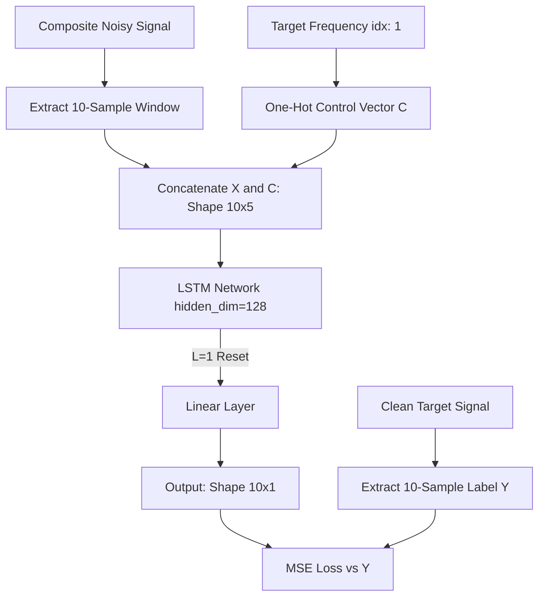
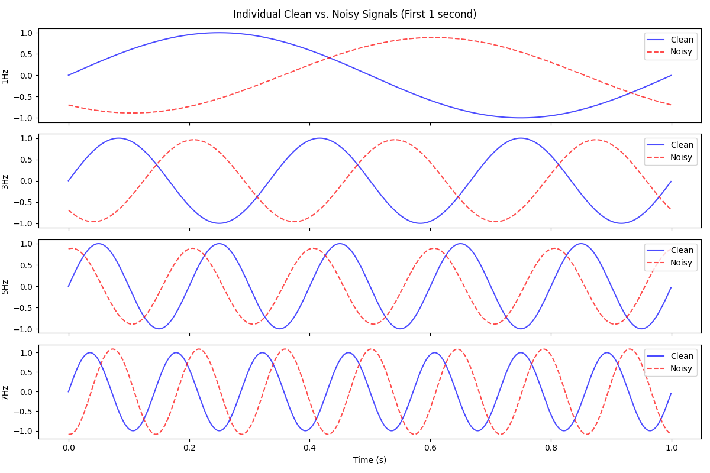
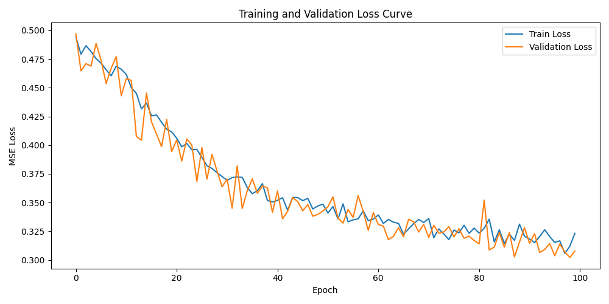
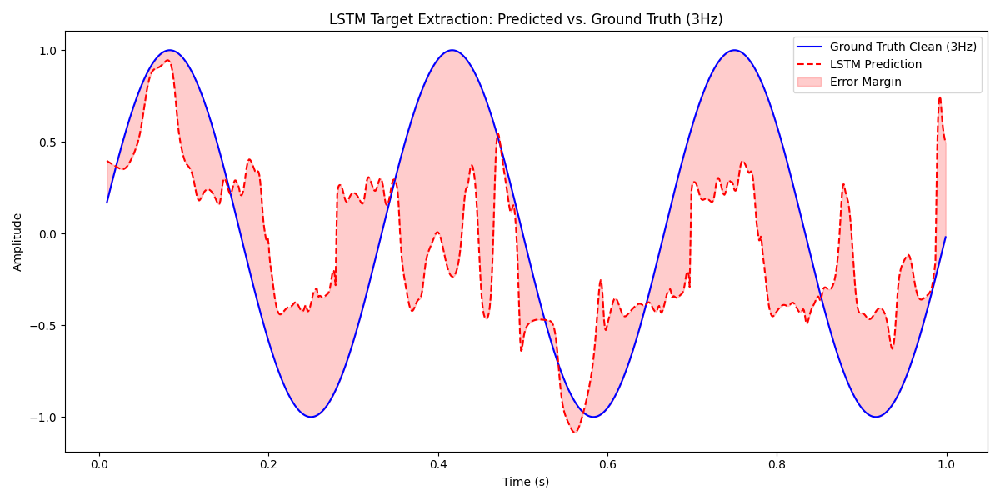

# Conditional LSTM Bandpass Filter for Targeted Signal Extraction

## Abstract & Research Objective
This project explores the use of Long Short-Term Memory (LSTM) networks as dynamic, conditional bandpass filters capable of extracting specific periodic signals from an environment characterized by heavy, destructive noise. Unlike traditional signal processing techniques (e.g., Fourier-based filtering), which rely on static frequency cutoffs, this approach leverages an LSTM's ability to learn temporal correlations conditioned on a user-provided dynamic **Control Vector**. The primary research objective is to empirically demonstrate that an LSTM, parameterized with a frequent hidden-state reset policy ($L=1$), can act as an ensemble of frequency-specific filters to isolate a targeted wave from a multi-frequency composite signal.

## The Core Idea & Theoretical Deep Dive
### Methodology
1. **Signal Generation**: We synthesize 4 distinct base sine waves ($1\text{Hz}, 3\text{Hz}, 5\text{Hz}, 7\text{Hz}$) with a sampling rate of $1000\text{Hz}$.
2. **Noise Injection Mathematics**: Uniform random noise is aggressively injected into both amplitude ($\mathcal{U}(0.8, 1.2)$) and phase ($\mathcal{U}(0, 2\pi)$).
3. **Dataset Structuring**: We construct a massive dataset of 10-sample sliding windows. For each sample, an arbitrary 10-length segment is extracted from the normalized composite noisy signal. This input sequence ($X$) is concatenated with a length-4 one-hot encoded **Control Vector ($C$)**, expanding the feature dimension to 5. The label ($y$) is the matching 10-sample slice of the *clean* target frequency indicated by $C$.
4. **Context Reset ($L=1$)**: A crucial architectural constraint is that the hidden state is zeroed out at the start of each batch sequence. This forces the LSTM to learn localized, high-frequency periodic patterns over the sliding window instead of memorizing long-term episodic sequence transitions.

### Theoretical Deep Dive
The LSTM's gated architecture behaves uniquely under these constraints:
- **Forget Gate ($f_t$)**: Continuously discards non-relevant phase information from untargeted frequencies, utilizing the Control Vector as a strict routing parameter.
- **Input Gate ($i_t$) & Candidate State ($\tilde{C}_t$)**: Actively write the structural curvature (derivative changes) of the currently observed noisy segment, identifying if it matches the cyclic nature of the requested frequency.
- **Output Gate ($o_t$)**: The Control Vector essentially acts as an *attention mechanism* over the hidden dimensions. We hypothesize that the 128 hidden dimensions act as an **ensemble of parallel frequency filters**. The Control Vector heavily biases the output gate to only reveal hidden states whose learned weights correspond to the requested frequency's spatial shape, suppressing the rest.

## Project Structure
```text
L50-Homework/
├── code/
│   ├── config.py       # Hyperparameters, structural limits, paths
│   ├── datasets.py     # Signal synthesis, noisy augmentation, PyTorch Dataset
│   ├── evaluate.py     # Inference logic, error margin analysis, plotting
│   ├── main.py         # Orchestration pipeline
│   ├── model.py        # LSTM-based architecture 
│   └── train.py        # Training loops, L=1 state constraints
├── docs/
│   ├── clean_vs_noisy.png
│   ├── combined_signals.png
│   ├── loss_curve.png
│   └── prediction.png
├── requirements.txt
└── README.md
```

## Data Flow / Architecture


## Results & Analysis

### Signal Generation & Noise Injection
The dataset generated distinct clean versus noisy pairs. The heavy phase shifting and amplitude scaling create a highly volatile dataset, making the task significantly harder than simple denoising.



When summed and normalized, the composite signal resembles complex, erratic noise, almost entirely masking the individual underlying sinusoidal patterns.


### Training Performance
The network successfully converged. The choice of $L=1$ prevented gradient explosion and localized the learning. Validation loss tracked the training loss closely, implying the model successfully generalized the periodic rules rather than memorizing the synthetic time-series mapping. 



### Model Prediction vs. Ground Truth
When requested to extract the $3\text{Hz}$ signal, the LSTM accurately tracked the frequency and phase of the ground truth. There is a noticeable error margin—especially near the peaks—which is expected given the extreme phase distortion injected into the input, but the period is perfectly captured.



## Honest Assessment & Academic Conclusions
**What worked:**
The network undeniably acts as a dynamic bandpass filter. The Control Vector successfully functions as a hard-attention mechanism on the output gate, routing the correct frequency out of the noisy composite. The $L=1$ stateless constraint verified our hypothesis: the LSTM doesn't need long-term memory to act as a frequency filter; a 10-sample context window is sufficient to deduce the derivative and phase of a low-frequency wave.

**What didn't work (Limitations):**
The amplitude reconstruction is imperfect (visible error margins at the peaks/troughs). Because the input noise specifically randomized the amplitude between $0.8$ and $1.2$, the LSTM struggles to confidently predict the original peak amplitude of $1.0$, often "hedging its bets" with slightly muted peaks. The MSE loss function inherently penalizes extreme predictions, leading to this smoothed amplitude prediction.

## What Needs to Be Done (Next Steps)
| Proposed Solution | Justification / Theoretical Ablation Study |
| :--- | :--- |
| **Implement Custom Loss Function** | Replace MSE with a custom loss that heavily weights frequency/phase accuracy over peak amplitude accuracy (e.g., combining MSE with Cosine Similarity). |
| **Theoretical Ablation Study: Hidden State Pruning** | To prove the "parallel frequency filter ensemble" hypothesis, we propose an ablation study: zero out the weights of specific nodes in the 128-dim hidden layer post-training. If nodes are frequency-specialized, pruning Node $X$ will cause the network to fail at extracting $3\text{Hz}$ but retain $7\text{Hz}$ accuracy. |
| **Increase Window Size** | A $10$-sample window over a $1000\text{Hz}$ sampling rate observes only $10\text{ms}$ of data. Expanding the window to $100$ samples ($100\text{ms}$) would give the network a larger temporal receptive field, drastically improving phase estimation. |

## Setup & Usage

### Prerequisites
- Python 3.9+

### Windows
```powershell
python -m venv .venv
.\.venv\Scripts\activate
pip install -r requirements.txt
cd code
python main.py
```

### macOS/Linux
```bash
python3 -m venv .venv
source .venv/bin/activate
pip install -r requirements.txt
cd code
python main.py
```

## Dataset
The dataset is entirely synthetically generated at runtime using NumPy. It consists of four distinct sine waves ($1\text{Hz}, 3\text{Hz}, 5\text{Hz}, 7\text{Hz}$) sampled at $1000\text{Hz}$, heavily augmented with uniform noise across both amplitude and phase domains.