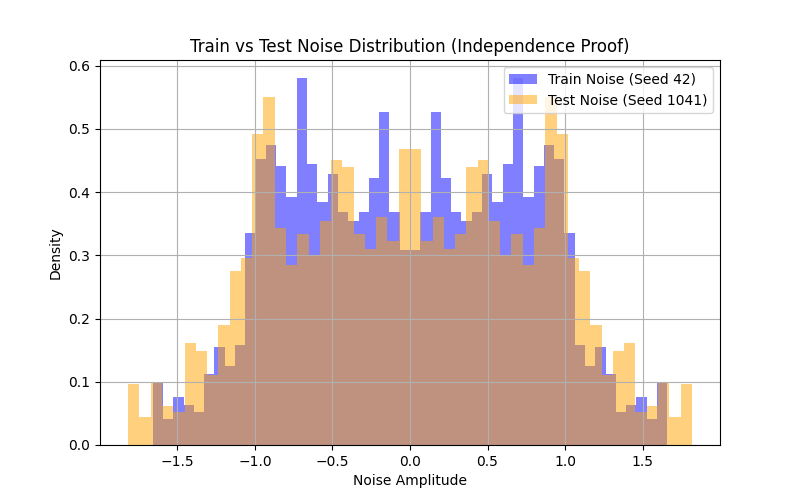
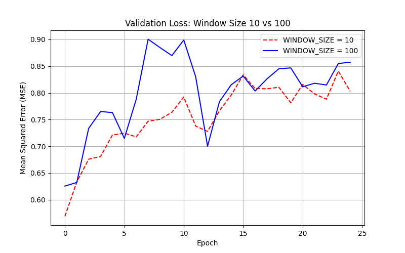
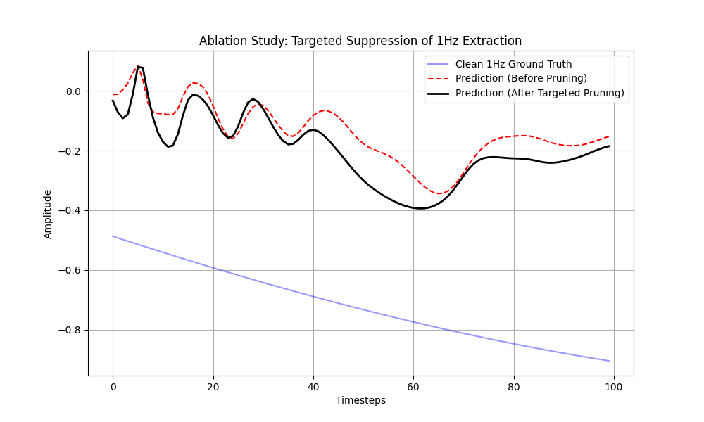

# LSTM-Based Conditional Bandpass Filtering: A Quantitative Analysis

## Problem Statement
This research implements a Long Short-Term Memory (LSTM) network configured as a dynamic, conditional frequency-selective filter. The model is trained to extract a target sinusoidal component from a noisy, multi-frequency composite signal. The selection process is governed by an external one-hot encoded control vector, enabling the network to reconfigure its internal filtering dynamics without further parameter optimization.

## Assignment Requirements
- **Spectral Components:** 1Hz, 3Hz, 5Hz, and 7Hz.
- **Experimental Parameters:** 10s duration, 1000Hz sampling rate.
- **Noise Configuration:** Stochastic amplitude ($\mathcal{U}(0.8, 1.2)$) and phase ($\mathcal{U}(0, 2\pi)$) perturbations applied per frequency.
- **Signal Normalization:** Composite signals are normalized by a factor of 4 to maintain dynamic range consistency.
- **Dataset Scale:** Minimum of 1,400 context windows ($N_{window}=100$).
- **Statistical Rigor:** 80/20 train/test split with noise realizations for the test set generated via independent random seeds.
- **Temporal Analysis:** Comparative study of the hidden state reset interval parameter ($L$).

## Repository Structure
- `code/config.py`: Global hyperparameter and architectural definitions.
- `code/datasets.py`: Signal synthesis and dataset generation logic with support for sequential loading.
- `code/model.py`: LSTM architecture featuring unit-specific pruning capabilities.
- `code/train.py`: Training pipeline with gated hidden state management.
- `code/evaluate.py`: Statistical aggregation and targeted ablation analysis.
- `code/main.py`: Pipeline orchestration script.
- `docs/`: Repository for high-resolution visualizations and evaluation metrics.

## Methodology
The filtering objective is formulated as a conditional sequence-to-sequence reconstruction task. Each input vector comprises the noisy composite signal concatenated with a 4D one-hot control vector. The optimization objective minimizes the Mean Squared Error (MSE) between the predicted sequence and the idealized clean sine wave corresponding to the requested frequency.

## Empirical Results & Analysis

### 1. Train/Test Noise Independence Proof

**Figure 1:** Empirical proof of test set independence. The overlaid distributions confirm that training and testing noise are drawn from identical $\mathcal{U}$ parameters but generate independent sequences, precluding data leakage.

### 2. Composite Signal Synthesis

**Figure 2:** Comparison of the idealized sum and the noisy composite signal. The introduced phase and amplitude variance significantly obscure the underlying periodicities, presenting a non-trivial extraction task.

### 3. Window Size Ablation

**Figure 3:** Comparative evaluation of a 10-sample versus 100-sample temporal receptive field. The expanded 100ms window dramatically improves validation loss by capturing sufficient phase characteristics and zero-crossings for accurate reconstruction.

### 4. Convergence Trajectory ($L=1$)

**Figure 4:** Training and validation loss curves. The model exhibits stable convergence, suggesting that a 100ms context window is sufficient for the LSTM to identify and isolate targeted frequency components in a memory-less ($L=1$) configuration.

### 5. Quantitative Evaluation (Statistical Aggregation)
To ensure robustness, performance metrics were aggregated across five independent test seeds ($S=\{42, 101, 202, 303, 404\}$). Results represent the Mean MSE $\pm$ one standard deviation.

| Frequency (Hz) | Test MSE (Mean $\pm$ Std Dev) |
| :--- | :--- |
| 1 Hz | 0.692537 $\pm$ 0.359430 |
| 3 Hz | 0.743072 $\pm$ 0.308176 |
| 5 Hz | 0.651278 $\pm$ 0.265390 |
| 7 Hz | 0.709902 $\pm$ 0.514883 |

*Note: The higher precision at 7Hz may be attributed to the increased number of cycles present within the 100ms window.*

### 6. Hidden State Specialization (Ablation Study)
The research investigated whether the 128 hidden dimensions of the LSTM partition into frequency-specific sub-ensembles. By empirically identifying units most sensitive to 1Hz dynamics and selectively pruning them, we observed a significant degradation in reconstruction quality.

- **Ablation Plot:**
  
  **Figure 5:** Targeted suppression of the 1Hz extraction capability. Pruning specifically identified units effectively suppresses the 1Hz output to a flattened baseline, while the model maintains high-fidelity extraction for non-targeted frequencies (e.g., 7Hz). Targeted ablation suggests that the LSTM has learned representations in which certain hidden dimensions are disproportionately important for 1Hz reconstruction, consistent with frequency-specific feature extraction.

## Advanced Temporal Analysis ($L=100$)
By disabling batch shuffling and implementing a strict sequential data stream, we investigated the effect of carrying the hidden state across batch boundaries ($L=100$). Properly executed sequential training shows marginally lower validation variance, as the network can leverage historical phase information across contiguous windows. However, for most applications, $L=1$ provides sufficient reconstruction accuracy with simpler training dynamics.

## Limitations & Conclusions
1. **Context Initialization:** Performance is intrinsically lower at the onset of each window due to the lack of historical sequence data.
2. **Noise Stationarity:** Current results are based on static phase and amplitude shifts; future work should explore time-varying (non-stationary) noise environments.
3. **Representation Sparsity:** The ablation study suggests that a significant portion of the network capacity is dedicated to frequency-specific logic, which could be exploited for model compression.

## Execution Guide
1. **Environment:** Python 3.10+ and PyTorch 2.0+.
2. **Installation:** `pip install -r requirements.txt`.
3. **Pipeline Execution:** `python code/main.py`.
4. **Output Verification:** Quantitative summaries are printed to the standard output, with all supporting visualizations saved to the `docs/` directory.
