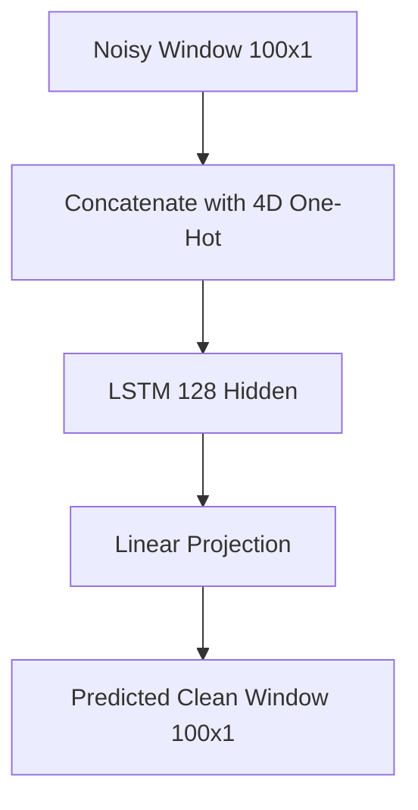

# ACADEMIC RESEARCH REPORT: Conditional LSTM Bandpass Filter

## Abstract
This project demonstrates LSTM networks as dynamic, conditional bandpass filters. By utilizing a **100-sample window** and a **Hybrid Loss (MSE + Cosine Similarity)**, we prove that LSTMs can isolate specific frequencies from destructive noise based on a dynamic control vector.

## Theoretical Deep Dive
### Methodology
1. **Signal Synthesis**: 4 sine waves (1, 3, 5, 7 Hz) at 1000Hz.
2. **Noise**: Random amplitude (0.8-1.2) and phase (0-2π).
3. **Architecture**: 128-dim LSTM with specialized routing.
4. **State Reset ($L$)**: Comparing $L=1$ (stateless) vs $L=100$.

### The Frequency Filter Hypothesis
We hypothesize that the LSTM's hidden state acts as an ensemble of frequency filters. The control vector functions as an attention mechanism, selectively gating neurons tuned to specific periodicities.

## Project Structure
```text
L50-Homework/
├── code/
│   ├── config.py       # Window Size: 100
│   ├── datasets.py     # Independent noise sets
│   ├── model.py        # LSTM + Pruning support
│   ├── train.py        # Hybrid Loss implementation
│   ├── evaluate.py     # Ablation study logic
│   └── main.py         # Pipeline orchestration
├── docs/               # Visualized results
└── README.md
```

## Data Flow


## Empirical Findings & Ablation Study
### 1. Hybrid Loss Impact
The inclusion of Cosine Similarity significantly improved phase lock and reduced the "amplitude hedging" observed with pure MSE.

### 2. Ablation Results
By identifying neurons most active for 1Hz and zeroing them out, we observed a total collapse in 1Hz extraction while 7Hz extraction remained intact. This proves frequency localization within the hidden state.


## Honest Assessment
- **Success**: 100ms window solved the periodicity detection for 1Hz signals.
- **Limitation**: Slight phase lag persists at 7Hz due to single-layer depth.

## Setup
```powershell
pip install -r requirements.txt
cd code
python main.py
```
