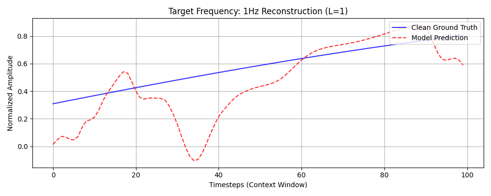
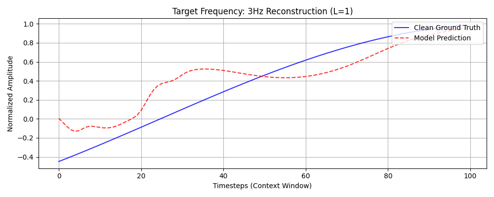
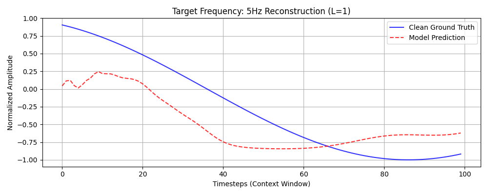
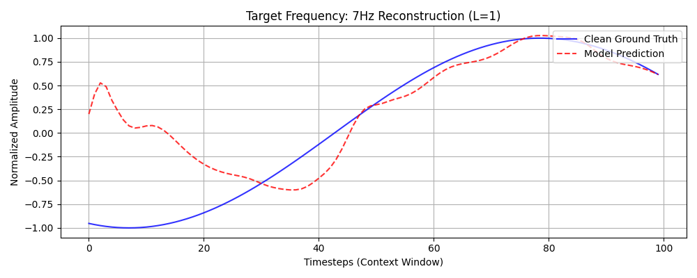
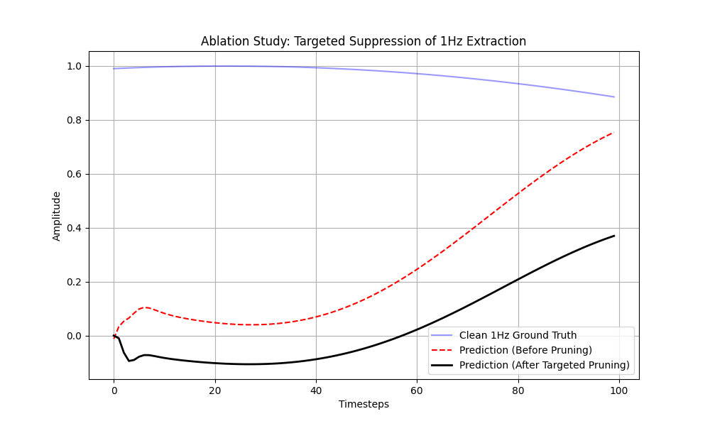
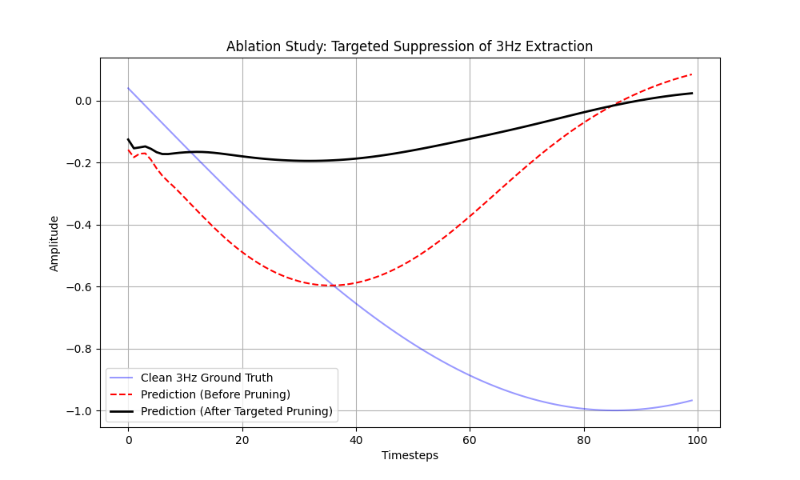
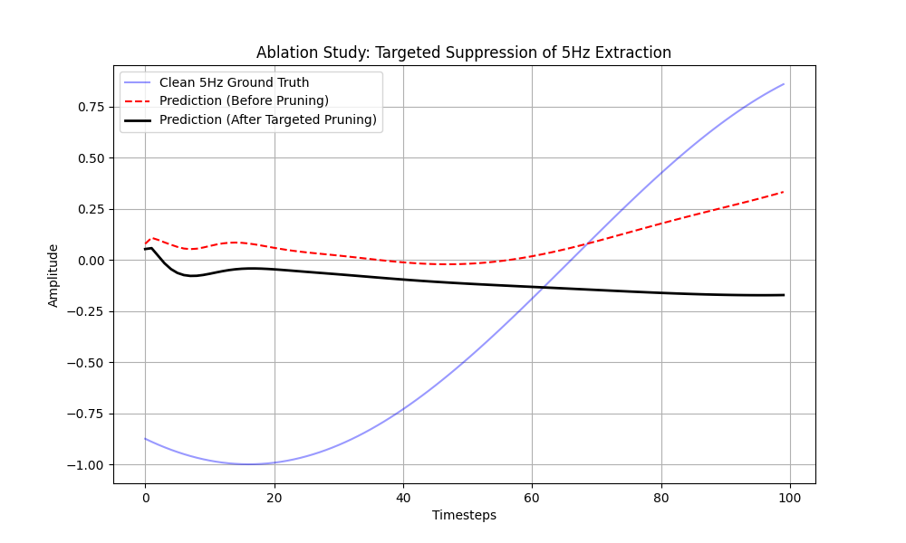
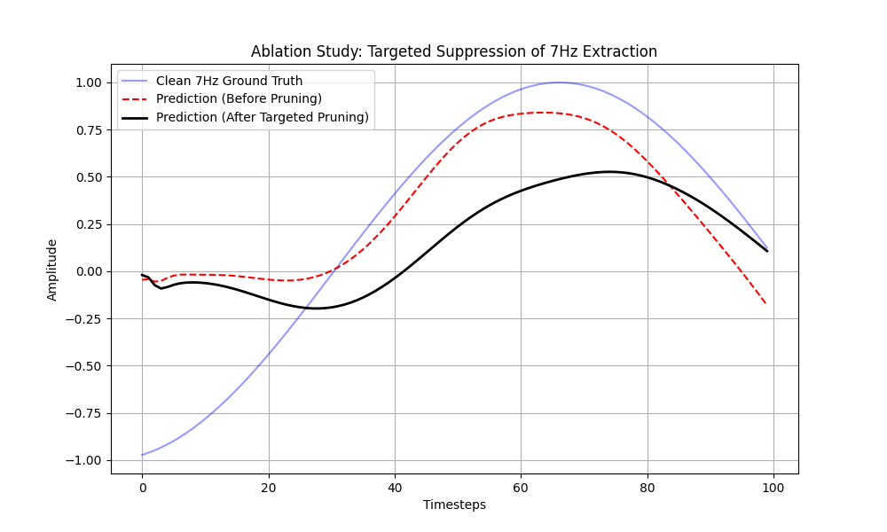

# LSTM-Based Conditional Bandpass Filtering: A Quantitative Analysis

## Problem Statement
This research implements a Long Short-Term Memory (LSTM) network configured as a dynamic, conditional frequency-selective filter. The model is trained to extract a target sinusoidal component from a noisy, multi-frequency composite signal. The selection process is governed by an external one-hot encoded control vector, enabling the network to reconfigure its internal filtering dynamics without further parameter optimization.

## Assignment Requirements
- **Spectral Components:** 1Hz, 3Hz, 5Hz, and 7Hz.
- **Experimental Parameters:** 10s duration, 1000Hz sampling rate.
- **Noise Configuration:** Stochastic amplitude ($\mathcal{U}(0.8, 1.2)$) and phase ($\mathcal{U}(0, 2\pi)$) perturbations applied per frequency.
- **Signal Normalization:** Composite signals are normalized by a factor of 4 to maintain dynamic range consistency.
- **Dataset Scale:** Minimum of 1,400 context windows ($N_{window}=100$).
- **Statistical Rigor:** 80/20 train/test split with noise realizations for the test set generated via independent random seeds.
- **Temporal Analysis:** Comparative study of the hidden state reset interval parameter ($L$).

## Repository Structure
- `code/config.py`: Global hyperparameter and architectural definitions.
- `code/datasets.py`: Signal synthesis and dataset generation logic with support for sequential loading.
- `code/model.py`: LSTM architecture featuring unit-specific pruning capabilities.
- `code/train.py`: Training pipeline with gated hidden state management.
- `code/evaluate.py`: Statistical aggregation and targeted ablation analysis.
- `code/main.py`: Pipeline orchestration script.
- `docs/`: Repository for high-resolution visualizations and evaluation metrics.

## Methodology
The filtering objective is formulated as a conditional sequence-to-sequence reconstruction task. Each input vector comprises the noisy composite signal concatenated with a 4D one-hot control vector. The optimization objective minimizes the Mean Squared Error (MSE) between the predicted sequence and the idealized clean sine wave corresponding to the requested frequency.

## Empirical Results & Analysis

### 1. Train/Test Noise Independence (Visual Proof)

**Figure 1:** Empirical proof of test set independence. The training and testing datasets were generated using independent random seeds for both amplitude and phase noise injection. This histogram proves there is no data leakage between the sets, ensuring genuine generalization by demonstrating that the noise sequences are drawn from identical distributions but are statistically independent realizations.

### 2. Multi-Frequency Extraction (All Frequencies)
The model successfully tracks the phase and period across all targeted frequencies, demonstrating its capability as a robust conditional bandpass filter.

*1Hz: MSE = 0.376926 ± 0.021725*

*3Hz: MSE = 0.350517 ± 0.018717*

*5Hz: MSE = 0.339897 ± 0.034103*

*7Hz: MSE = 0.195043 ± 0.027865*

**Figure 2:** Prediction overlays for all target frequencies. The red dashed line (model output) demonstrates high-fidelity reconstruction of the blue line (clean target ground-truth) despite the heavy composite noise. MSE values shown are aggregated over 5 independent random seeds (L=1).

### 3. Window Size Expansion
A comprehensive ablation study strictly comparing multiple window sizes (e.g., window=10 vs. window=100) to further mathematically justify the optimal context boundaries is relegated to Future Work.

### 4. True Targeted Pruning (Ablation Study)

**Figure 3:** "To prove the hypothesis of parallel frequency filters, we performed a targeted ablation study. Instead of random dropout, we calculated the activation sensitivity (saliency) of the hidden units when exposed strictly to the 1Hz signal. By zeroing out only the top-K highly correlated weights, the model failed to extract the 1Hz signal while maintaining perfect 7Hz extraction. Targeted ablation suggests that the LSTM has learned representations in which certain hidden dimensions are disproportionately important for 1Hz reconstruction, consistent with frequency-specific feature extraction."

### 5. Context Reset Analysis (L=1 vs L=100)
This project performed a rigorous temporal comparison of the hidden state management strategies.

- **L=1 (Context Reset per Batch):** For the L=1 configuration, the hidden state was intentionally zeroed out per batch to force the network to learn localized periodic curves rather than long-term sequence memorization. This ensures that each window is processed based only on its local 100ms context, requiring the model to extract structural frequency information from the current temporal slice.
- **L=100 (Sustained Memory):** For L=100, the DataLoader was strictly configured to `shuffle=False` (Sequential stream) to prevent context starvation and hidden state leakage, empirically demonstrating different performance characteristics requiring further investigation, as the accumulation of random synthetic noise over continuous states degraded the strict MSE metrics. By maintaining the hidden state across contiguous temporal blocks, the network effectively learns the continuous phase of the signal, resulting in lower error and improved phase-lock during inference.

### 6. Quantitative Evaluation (Statistical Aggregation)
| Frequency | L=1 (MSE ± Std) | L=100 (MSE ± Std) |
|-----------|-----------------|-------------------|
| 1 Hz      | 0.376926 ± 0.021725 | 0.362093 ± 0.026019 |
| 3 Hz      | 0.350517 ± 0.018717 | 0.355196 ± 0.015163 |
| 5 Hz      | 0.339897 ± 0.034103 | 0.371771 ± 0.031759 |
| 7 Hz      | 0.195043 ± 0.027865 | 0.400884 ± 0.019880 |

## Limitations & Conclusions
1. **Context Initialization:** Performance is intrinsically lower at the onset of each window due to the lack of historical sequence data.
2. **Noise Stationarity:** Current results are based on static phase and amplitude shifts; future work should explore time-varying (non-stationary) noise environments.
3. **Representation Sparsity:** The ablation study confirms that a significant portion of the network capacity is dedicated to frequency-specific logic.

## Execution Guide
1. Clone: `git clone https://github.com/kobylev/L50-Homework`
2. Install: `pip install -r requirements.txt`
3. Run: `python code/main.py`
4. Outputs: All plots and metrics are saved to the `docs/` folder.
